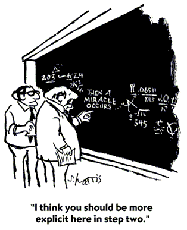

  

<h3 align="center">Blueshift Demo Strategies</h3>

 

  <h3>
    <a href="https://quantra-blueshift.quantinsti.com">
      Website
    </a>
     | 
    <a href="https://quantra.quantinsti.com/courses">
      Quantra
    </a>
     | 
    <a href="https://quantra-blueshift.quantinsti.com/docs/dataset">
      Dataset
    </a>
     | 
    <a href="https://www.quantinsti.com/blog/">
      Blog
    </a>
  </h3>

 

[Blueshift](https://quantra-blueshift.quantinsti.com/) is a systematic trading development platform with built-in market data covernig multiple markets and asset classes.

This repository lists a number of demo strategies to show the use cases of 
Blueshift development platform. 

Note: the strategies here are for demonstration purpose only. Possible 
improvements include optimizing parameters and improvement in trading 
costs and slippage, among others. These are not investment recommendations
or solicitations.

## Some Definitions

``Systematic Trading``: **Trading decisions** in a methodical way defining 
trading goals, risk controls and rules

``Quantitative Trading``: Trading **signal generation** based on 
quantitative analysis

``Algorithmic Trading``: **Execution** of trades using automated 
pre-programmed trading instructions

``Hi-Frequency Trading``: Algorithmic trading characterized by 
**high speed, high turn-over rates and high order-to-trade** ratios

### Three Degrees of Freedom

* How trading and or other decisions are 
    <strong>evaluated</strong> (Quant or 
    Qualitative signal generation)
* How trading and other decisions are 
    <strong>finalized</strong> (Rule-based 
    or discretionary decisions/ order generations)
* How those trades are <strong>executed</strong>
    (Automated or manual) 

## What is Blueshift

Systematic Trading Strategies – For Everyone!

## Trading Strategy

``Strategy``: A set of rules or a well-defined algorithm to choose an 
action from the set of all possible actions in any state of a game.

``Trading Strategy``: Strategy (above). The game is stochastic 
(state transitions are probabilistic), massively multi-player and 
potentially long running.

### The Game Plan

* Usually the number of participants is large, hence we create the 
    concept of “market” (unlike smaller games like auctions or business 
    negotiations)
* Essentially the market manifests itself in terms of the tradable 
    assets (what you can trade), their prices (at what levels) and the 
    liquidity (and how much)
* We make assumptions to understand how state changes happen - A set of 
    theories from Economics that maps real-world to trading conditions and another set of theories on how the market process information to reflect changes in those conditions
* The first set of theories are in general known as asset pricing theories
* The second group of theories talks about market efficiency and 
    behavioural economics

## The Strategy Spectrum

## The Power of Large Numbers

### Tale of Two Styles 

Asset manager A is a discretionary manager and follows 10 stocks 
diligently. Asset manager B is a systematic manager and have enough 
computational power to track 500 stocks. Investors seek outperformance 
and confidence.

* ``Question #1``: What is the hit ratio for A to achieve outperformance 
    in at least 50% (total 5 stocks) of his portfolio with at least 95% 
    probability?
* ``Question #2``: What is the hit ratio for B to achieve outperformance 
    in at least 50% (total 250 stocks) of his portfolio with at least 95% 
    probability?

**Solution**: Let the success rate be p. Total required success n, 
total trial N. Probability of n success out of N trials is the binomial 
distribution.Compute the probability (1 - BINOM.DIST in Excel, with 
cumulative True). Solve for p, such that P is 0.95 in both cases.

### Fundamental Law

The fundamental law of investment management: ``IR ≈ IC . √N. TC``

* ``Information Ratio (IR)``: Measure of success – risk adjusted returns 
    over the chosen benchmark
* ``Information Coefficient (IC)``:Linear relationship between predicted 
    asset returns and realized returns, usually in the range of 0 to 1 
    (unlike correlation range of -1 to 1, as you can always short the 
    prediction of someone who is consistently wrong!!).
* ``Number of Bets (N)``: Number of independent bets that can be made 
    in a given time-frame.
* ``Transfer Coefficient (TC)``: The linear relationship between 
    predicted asset returns and actual trading positions. This ideally 
    should be one, but can be lower (risk limits, capital limit, 
    bandwidth problem due to work overload etc.)

## Systematic Strategy Design Cycle

### Systematic Strategy Development

* **Inputs**: Input to the strategies can come in many flavours like
    - Price/ returns and it’s transformation. Most of the common 
        technical indicators are transformation of price returns2
    - Positioning information – volumes and open interest data and 
        participant-wise positioning data if available
    - Fundamental information –macro-economic information, company 
        fundamentals
    - Non-market information: Example twitter sentiments, analysts 
        ratings etc.
* **Trading Rules/ Logic**: Can be either based on trader’s hypothesis 
    or inferred (learned) from data
    - Form hypothesis (e.g. moving average cross-over signals change 
        in trends) and test – traditional approach
    - Feed data to infer rules (the subject matter of machine learning 
        and artificial intelligence)
* **Back-testing and Forward-testing**: A crucial step and often 
    over-looked step. 
    - A good platform to guard against biases : data-mining bias, 
        survivorship bias, market-impact modeling, look-ahead bias
    - Should be  flexible, event-driven (to avoid look-ahead bias) 
        and with built-in analytics
* **Portfolio Creation/ Optimization**: Never go all-in with a single 
    strategy
    - Two strategies better than one – if they are uncorrelated 
        (in terms of signals and/ or performance)
    - Various methods exists –  ensemble, traditional portfolio theory, 
        dynamic portfolio allocation etc.

## Blueshift Work Flow

### How Blueshift API works

## Systematic Equities

### What is Alpha

* ΔF is k-variate I(0), ε is n-variate white noise (total instruments n, 
    total factors k). RPs are risk premia (k-variate I(0))
* Objective: Create portfolio to beat the market!
* First try: Capture any factor other than market – Jensen’s alpha!
* Holy Grail: 𝑅𝑃 (and ∆𝐹 too!) not time-dependent – pure alpha!
* Tough luck: try 𝑅𝑃 not time-dependent – Beta is the new alpha?
* Next: 𝑅𝑃 is stable and consistent – Focus on factor allocation!
* Time-varying but predictable? – Focus on market timing!
* Unstable and unpredictable on all scale? – go back to picking stocks!

## What is Momentum: Exploiting time series persistence

**Strategy-I**: Buy (sell) assets that have been going up (down) in 
prices in the past, hold them in the portfolio for a defined period of 
time (holding period), and then rebalance. This is known as ``time-series 
momentum``.

**Strategy-II**: Rank all assets based on their past returns. Buy the 
top x-percentile and sell the bottom x-percentile (even if they are 
going up in prices). Rebalance after the holding period. This is known 
as ``cross-sectional (classical) momentum``.

### Momentum: Everywhere

**Equities**: classic cross-sectional and time-series momentum (we have 
just seen it).

**Fixed income**: Central banks tend to hike (cut) rates in steps, 
leading to momentum effect on short term rates. Also economies 
undergoes business cycles that get reflected in rates and 
inflations – leading to trends in long term rates.

**Commodities**: One of the first markets to trade momentum 
(pioneer of technical analysis). A strong drivers are business 
cycles and persistence of under or over capacity (setting up factories 
require time). Tend to mean revert over long period.

**Foreign Exchange**: A large part of momentum is driven by the same 
factors as rates. 

### Momentum: Drivers

#### Behavioural

* **Under-Reaction**: Slow reactions to company specific or 
    macro-economic news (the opposing theory is known as ``Efficient 
    Market Hypothesis`` or ``EMH``). Conservative behaviour, bounded 
    rationality, liquidity constraints etc.
* **Delayed Over-Reaction**: Behavoiral feedback mechanism. This also 
    gets reinforced by under-reaction.
* **Disposition Effect**: Investors tend to stick to losers too long and 
    book profit too quick. Creates momentum.
    
#### Risk-based

* **Risk Compensation**: Market value of firm growing faster than 
    fundamental increases the risk, hence momentum profit should 
    compensate. Momentum is usually stronger for companies with higher 
    growth opportunities and riskier cash flows.
* **Correlation Structure**: Momentum assets strongly correlate with 
    each other, which implies a common factor which can experience 
    changes in future (momentum crash).
* **Liquidity Risks**: Recent winners have greater exposure to 
    liquidity risks (everyone tries to exit at the same time).

### Testing Momentum - Blueshift Pipelines

``Pipelines`` are efficient ways to compute a factor on a large universe. 
They are essentially computational graph.

* We attach a pipeline at the onset (``initialize``). This is done through
    ``attach_pipeline()``. Then call the results periodically:  
    ``pipeline_output()``. This returns usually a pandas dataframe with 
    multi-index (indexed by stocks and then timestamps).
    
* To define pipeline output, we define the ``factors``. This is 
    basically defining a class with a `compute` function that must 
    return the factor we are interested in. It takes a `input` 
    (usually the prices as ``numpy array``), a `window length` to 
    compute, and all assets in the database. It returns the computed 
    value.

### Developing Momentum strategies

Go to the example codes.

* xmom - a cross-sectional momentum strategy
* tsmom - a time-series momentum strategy
* vol_factor - a low-volatility factor strategy
* rsi_factor - shows the general idea of factor strategies.

### Momentum strategies: Maths

* **XSMOM**: 
    - auto-covariance
    - cross-covariance and 
    - cross-variance
    XSMOM is ``long`` auto-covariance (high returns of x => high returns of 
    x in next period is good) and cross variance in means (large 
    variations in stocks average returns is good), ``short`` 
    cross-covariance (high returns of x => high returns of y in next 
    period is bad: kind of short market beta)
    
* **TSMOM**: 
    - auto-covariance 
    - average drift
	TSMOM is ``long`` auto-covariance and long absolute drifts (strong market 
	trends)

